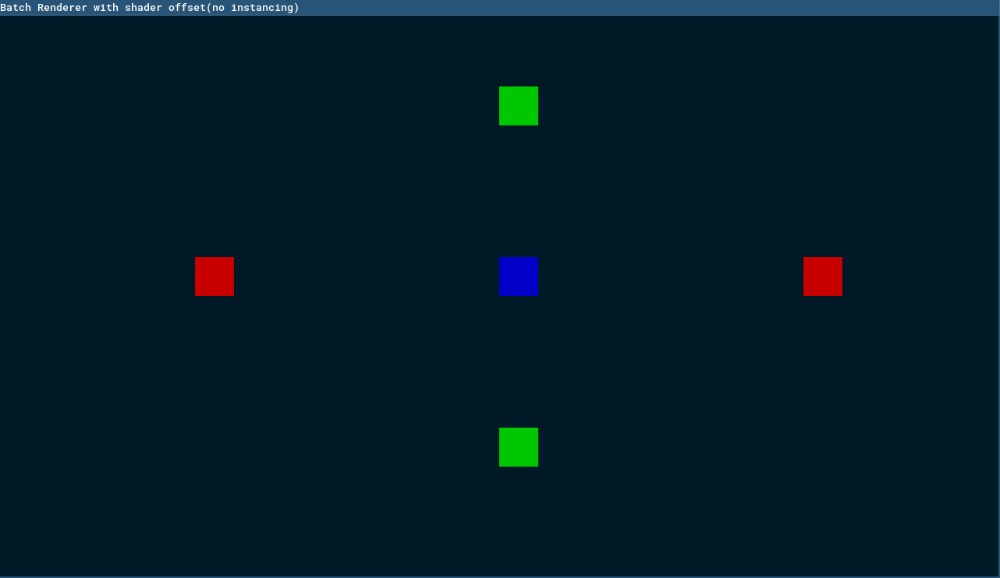

# batch renderer with shader offset

### Run
```console
odin run src
````



```console
odin run src -define:BUNNY_TEST=true
````


### For Linux 🫶
- Make sure SDL3 libs are installed on your computer.
